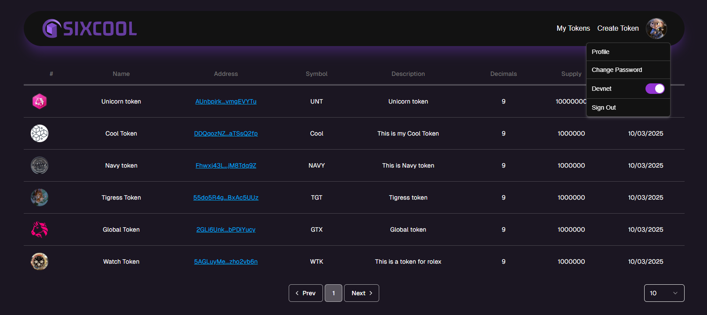
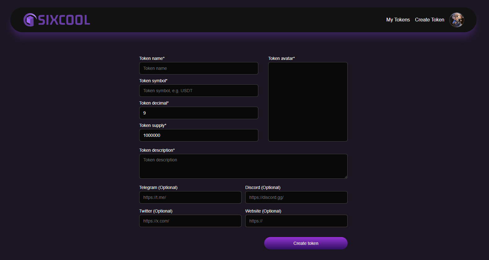

# Solana Token Mint Application

## Deployment

This platform is live on [https://solana-tokenmint-service.vercel.app/](https://solana-tokenmint-service.vercel.app/).

## Features

* Create and mint tokens: Users can create new token accounts and mint tokens there. Token minting is performed at once, it means that users can create token accounts, mint tokens, revoke authorities with one confirmation on his wallet. This is tested with `Phantom` wallet.

* Metadata: Every tokens will have their meta data with external links like telegram, discord, twitter and custom website.

* Environment: Users can switch between `mainnet-beta` and `devnet` environment

* List Tokens: All token infos which users minted are stored on supabase. Users can see the token list on dashboard.

* Simple authentication system with email and password.

## Tech Stack

* Next.js v14, App Routing, Next API
* Supabase
* `solana/web3.js`, `spl-token`
* Shadcn UI, Tailwind CSS
